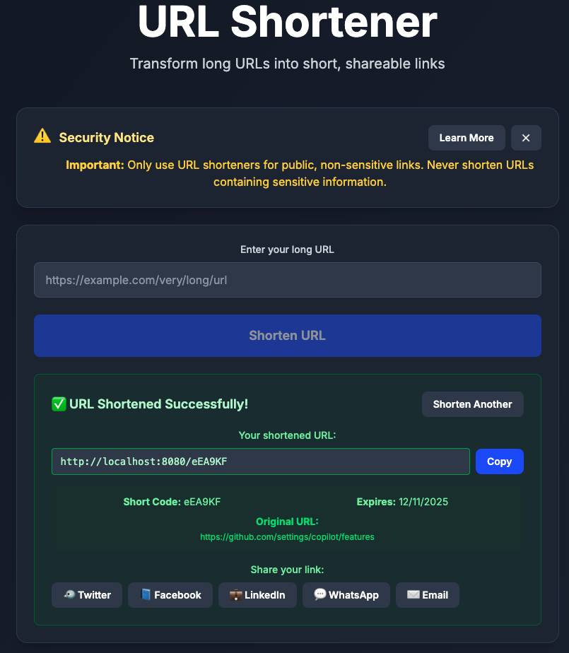

# URL Shortener

A modern, fully functional URL shortener application built with Java Spring Boot backend and React TypeScript frontend.

## 🚀 Features

**Current Status: Phase 4 - Integration & Testing (80% Complete)**

- ✅ **Project Architecture**: Complete development environment setup
- ✅ **Docker Ready**: Complete containerized development environment
- ✅ **URL Shortening**: Full backend implementation with Base62 encoding
- ✅ **Instant Redirection**: Backend redirection service with expiration support
- ✅ **Custom Short Codes**: Support for user-defined short codes
- ✅ **Comprehensive Testing**: 41 passing backend tests covering all functionality
- ✅ **Statistics & Analytics**: Enhanced URL usage statistics with privacy features
- ✅ **Modern Frontend**: Complete React UI with Tailwind CSS and responsive design
- ✅ **Security Features**: User education and privacy-preserving URL display
- ✅ **Full Integration**: Frontend-backend integration working end-to-end
- 🔄 **Production Ready**: Final testing and deployment preparation

## 🏗️ Architecture

- **Backend**: Spring Boot 3.4.0 with Java 21
- **Frontend**: React 18 with TypeScript and Vite  
- **Database**: MongoDB for fast NoSQL operations
- **Deployment**: Docker Compose for local development, AWS-ready architecture

## 📸 Application Preview



## ✨ Enhanced Features

Beyond the MVP scope, this implementation includes advanced features:

### 🎨 Modern Frontend
- **Tailwind CSS v4.1.16**: Professional gradients and responsive design
- **Component Architecture**: Reusable UI components (Button, Input, Card, LoadingSpinner)
- **Dark Mode Support**: Built-in theme compatibility
- **Copy-to-Clipboard**: One-click sharing with visual feedback
- **Real-time Validation**: Instant URL validation and error feedback

### 📊 Statistics Dashboard
- **Real-time Analytics**: Total URLs, clicks, active/expired counts
- **Privacy-Preserving Display**: URL paths redacted in public statistics
- **Recent URLs Tracking**: Latest shortened URLs with metadata
- **Visual Indicators**: Professional UI with loading states and animations

### 🔒 Security & Privacy
- **Security Awareness Component**: User education about URL shortener risks
- **Privacy Protection**: Sensitive URL parts hidden in statistics display
- **Input Validation**: Comprehensive frontend and backend validation
- **Error Handling**: Professional error messages and recovery

### 🚀 Performance Features
- **Sub-second Response Times**: Optimized API endpoints
- **Efficient Database Queries**: MongoDB indexing and query optimization
- **Click Tracking**: Enhanced analytics with performance monitoring
- **Automatic Cleanup**: Expired URL removal with statistics tracking


## 📄 Documentation

- [Security](docs/SECURITY.md)
- [Development Plan](docs/DEVELOPMENT_PLAN.md)
- [Testing](docs/TESTING.md)

## 🛠️ Quick Start

### Prerequisites

- **Docker & Docker Compose** (recommended)
- **Java 21+** (if running backend locally)
- **Node.js 18+** (if running frontend locally)
- **MongoDB** (if running database locally)

### Option 1: Docker Compose (Recommended)

1. **Clone the repository**
   ```bash
   git clone https://github.com/yourusername/urlShortener.git
   cd urlShortener
   ```

2. **Start all services**
   ```bash
   docker-compose up --build
   ```

3. **Access the application**
   - **Frontend**: http://localhost:3000 (Complete React URL Shortener Interface)
   - **Backend API**: http://localhost:8080 (Fully functional REST API)
   - **Health Check**: http://localhost:8080/actuator/health  
   - **URL Shortening**: http://localhost:8080/api/shorten
   - **Enhanced Statistics**: http://localhost:8080/api/stats
   - **MongoDB**: Available on host port 27018 (container port 27017)

**✅ Application Status**: Fully functional URL shortener with modern UI and comprehensive backend API.

**Note**: Docker setup uses MongoDB on port 27018 to avoid conflicts with local MongoDB instances.

### Option 2: Local Development

#### Prerequisites for Local Development
- **Java 21+** (Amazon Corretto recommended)
- **Node.js 18+** 
- **MongoDB** running locally on port 27017

#### Setup Steps

1. **Start MongoDB locally**
   ```bash
   # Option 1: Using Docker (if you don't have MongoDB installed)
   docker run -d -p 27017:27017 --name mongodb-local mongo:6
   
   # Option 2: Use your existing local MongoDB installation
   # Ensure MongoDB is running on localhost:27017
   ```

2. **Start Backend with Development Profile**
   ```bash
   cd backend
   
   # Generate Maven wrapper (if not already done)
   mvn wrapper:wrapper
   
   # Run with development profile (connects to localhost:27017)
   ./mvnw spring-boot:run -Dspring-boot.run.profiles=dev
   
   # Alternative: Set environment variable
   SPRING_PROFILES_ACTIVE=dev ./mvnw spring-boot:run
   ```

3. **Start Frontend**
   ```bash
   cd frontend
   npm install
   npm run dev
   ```

4. **Access the application**
   - Frontend: http://localhost:5173 (Vite dev server - basic React app)
   - Backend API: http://localhost:8080 (Fully functional URL shortener)
   - Health Check: http://localhost:8080/health
   - URL Shortening: http://localhost:8080/api/shorten
   - URL Stats: http://localhost:8080/api/stats


## 📡 API Endpoints

See [API_ENDPOINTS.md](docs/API_ENDPOINTS.md) for the full list of backend API endpoints and example requests/responses.


## 🧪 Testing

See [TESTING.md](docs/TESTING.md) for backend and frontend testing instructions, coverage, and manual API testing examples.


## 📦 Project Structure

See [PROJECT_STRUCTURE.md](docs/PROJECT_STRUCTURE.md) for a high-level overview of the project layout.

## 🔧 Development

### Environment Variables

The application supports different profiles for various environments:

**Development Profile** (for local development)
```bash
# Backend uses application-dev.properties
SPRING_PROFILES_ACTIVE=dev
# Connects to MongoDB on localhost:27017
```

**Docker Profile** (for Docker Compose)
```bash
# Backend uses application-docker.properties  
SPRING_PROFILES_ACTIVE=docker
# Connects to MongoDB container via service name
```

**Frontend Environment Variables**
Create `.env` file in frontend directory:
```
VITE_API_BASE_URL=http://localhost:8080
VITE_APP_TITLE=URL Shortener
```

**Configuration Files:**
- `application.properties` - Default configuration (local MongoDB on 27017)
- `application-dev.properties` - Development profile (local MongoDB on 27017, debug logging)  
- `application-docker.properties` - Docker profile (MongoDB container, production-like logging)

### Code Quality

- **Backend**: Uses Spring Boot best practices with comprehensive testing (41 passing tests)
- **Frontend**: TypeScript with ESLint configuration
- **Testing**: Complete unit and integration test coverage for backend
- **CI/CD**: GitHub Actions workflow configured but not yet active

## 🚀 Deployment

### Local Production Build
```bash
# Production Docker Compose setup is planned for Phase 3
# Currently available: Development Docker setup
docker-compose up --build
```

### AWS Deployment (Future)
- **Frontend**: AWS S3 + CloudFront
- **Backend**: AWS EC2/ECS with Application Load Balancer
- **Database**: MongoDB Atlas
- **Infrastructure**: AWS CDK/Terraform

## 🤝 Contributing

1. Fork the repository
2. Create a feature branch (`git checkout -b feature/amazing-feature`)
3. Commit your changes (`git commit -m 'Add amazing feature'`)
4. Push to the branch (`git push origin feature/amazing-feature`)
5. Open a Pull Request

## 📄 License

This project is licensed under the MIT License - see the [LICENSE](LICENSE) file for details.

## 🆘 Troubleshooting

### Common Issues

**Maven Wrapper Not Found**
```bash
cd backend
# Generate Maven wrapper
mvn wrapper:wrapper
# Then try running again
./mvnw spring-boot:run -Dspring-boot.run.profiles=dev
```

**MongoDB Connection Error**
```bash
# Check MongoDB is running
docker ps | grep mongo

# For local development, ensure MongoDB is on port 27017
# For Docker, MongoDB container is mapped to host port 27018

# Restart MongoDB
docker-compose restart mongodb
```

**Port Already in Use**
```bash
# Check what's using the port
lsof -i :8080  # Backend
lsof -i :3000  # Frontend (Docker)
lsof -i :5173  # Frontend (Local Vite)
lsof -i :27017 # Local MongoDB
lsof -i :27018 # Docker MongoDB

# Kill the process
kill -9 <PID>
```

**Build Failures**
```bash
# Clean and rebuild
docker-compose down
docker system prune -f
docker-compose up --build
```

## 📞 Support

For questions and support:
- Create an issue on GitHub